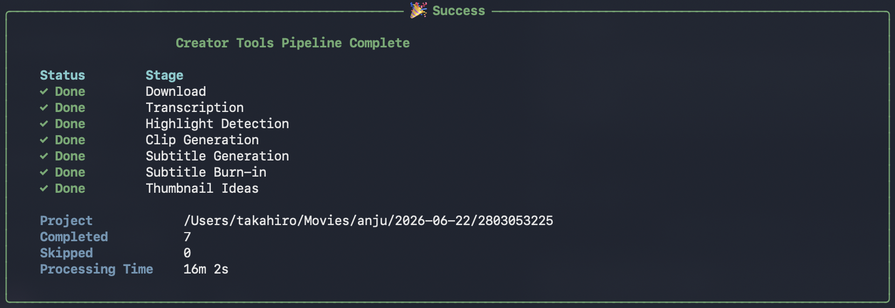

# Creator Tools

> AI-powered CLI toolkit for content creators.


Automatically transform a Twitch VOD into creator-ready assets with a single command.

```bash
anju pipeline https://www.twitch.tv/videos/123456789
```



Creator Tools automates repetitive video production tasks such as downloading Twitch VODs, transcribing audio, detecting highlights with AI, generating clips, creating subtitles, burning subtitles into videos, and suggesting thumbnail ideas.

The goal is simple:

> Spend more time creating content and less time editing.

---

# ✨ Features

- 🎬 Twitch VOD download
- 📁 Automatic project organization
- 🎙 Whisper transcription
- 🤖 Gemini highlight detection
- ✂ Automatic clip generation
- 💬 Subtitle generation
- 🔥 Subtitle burn-in
- 🖼 Thumbnail idea generation
- 🚀 End-to-end pipeline
- ✅ GitHub Actions CI
- 🧹 pre-commit hooks
- 🧪 Pytest test suite

---

# Workflow

```text
             Twitch VOD
                  │
                  ▼
          anju pipeline
                  │
                  ▼
             Download
                  │
                  ▼
      Transcription (Whisper)
                  │
                  ▼
   Highlight Detection (Gemini)
                  │
                  ▼
     Clip Generation (FFmpeg)
                  │
                  ▼
      Subtitle Generation
                  │
                  ▼
        Subtitle Burn-in
                  │
                  ▼
   Thumbnail Idea Generation
```

---

# Requirements

- Python 3.13+
- FFmpeg
- yt-dlp
- TwitchDownloaderCLI
- Gemini API Key

---

# Installation

Clone the repository.

```bash
git clone git@github.com:Takahiro-JP/creator-tools.git

cd creator-tools
```

Create a virtual environment.

```bash
python3.13 -m venv .venv

source .venv/bin/activate
```

Install dependencies.

```bash
python -m pip install -e ".[dev]"
```

---

# Configuration

Configuration file:

```text
~/.anju/config.json
```

Example:

```json
{
  "base_dir": "/Users/your-name/Movies/anju",
  "twitch_downloader_cli": "/Users/your-name/Tools/TwitchDownloader/TwitchDownloaderCLI"
}
```

Set your Gemini API key.

```bash
export GEMINI_API_KEY="your-api-key"
```

---

# Quick Start

Check your environment.

```bash
anju doctor
```

Run the entire workflow.

```bash
anju pipeline https://www.twitch.tv/videos/123456789
```

Run a lightweight pipeline.

```bash
anju pipeline \
    https://www.twitch.tv/videos/123456789 \
    --clip-limit 1 \
    --max-highlights 3
```

Regenerate all outputs.

```bash
anju pipeline \
    https://www.twitch.tv/videos/123456789 \
    --overwrite
```

---

# Commands

| Command | Description |
|----------|-------------|
| `doctor` | Check environment |
| `config` | Show configuration |
| `download` | Download Twitch VOD |
| `transcribe` | Whisper transcription |
| `highlight` | Gemini highlight detection |
| `clipgen` | Generate clips |
| `subtitle` | Generate subtitles |
| `burn-subtitle` | Burn subtitles into clips |
| `thumbnail` | Generate thumbnail ideas |
| `pipeline` | Execute the complete workflow |

Every command supports `--help`.

```bash
anju pipeline --help
```

---

# Project Structure

```text
creator-tools/

.github/
docs/
tests/

src/
└── anju/
    ├── ai/
    │   ├── client.py
    │   ├── prompts.py
    │   └── schemas.py
    │
    ├── commands/
    │
    ├── downloader.py
    ├── transcriber.py
    ├── highlighter.py
    ├── clipgen.py
    ├── subtitle.py
    ├── subtitle_burner.py
    ├── thumbnail.py
    ├── pipeline.py
    ├── project.py
    └── utils.py
```

---

# Generated Project

```text
2026-06-22/
└── 2803053225/
    ├── metadata.json
    ├── raw/
    ├── subtitles/
    ├── clips/
    ├── thumbnail/
    └── exports/
```

---

# Development

Run formatting.

```bash
ruff format src tests
```

Run lint.

```bash
ruff check src tests
```

Run tests.

```bash
pytest
```

Run every quality check.

```bash
pre-commit run --all-files
```

---

# Roadmap

## v0.4

- 🎯 YouTube title generation
- 📝 Description generation
- 🏷 Hashtag generation
- ⏱ Chapter generation

## v0.5

- 📤 YouTube upload
- 📅 Publish scheduling
- 📊 Analytics support

## v1.0

A complete AI-powered workflow for content creators.

```text
Twitch VOD
      │
      ▼
Creator Tools
      │
      ├── Download
      ├── Transcription
      ├── Highlight Detection
      ├── Clip Generation
      ├── Subtitle Generation
      ├── Burn Subtitles
      ├── Thumbnail Ideas
      ├── Title Generation
      ├── Description
      ├── Hashtags
      ├── Chapters
      │
      ▼
Creator Review
      │
      ▼
YouTube
```

---

# Contributing

Contributions, ideas, and bug reports are welcome.

Please open an Issue or Pull Request.

---

# License

MIT